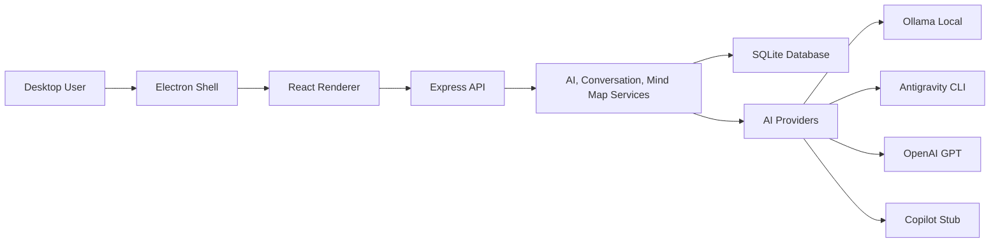

# Role AI Brainstorm Workspace

Role AI Brainstorm Workspace is a desktop-first brainstorming tool that combines a compact chat interface, role-based AI responses, and an incrementally updated mind map.

The project began as a web MVP and is now moving toward packaged Windows desktop software. The frontend and backend remain independently runnable for development, while the Electron shell is the target user runtime.

## Navigation

| Area | Document |
| --- | --- |
| Documentation Index | [docs/README.md](docs/README.md) |
| Architecture | [docs/architecture/README.md](docs/architecture/README.md) |
| API | [docs/api/README.md](docs/api/README.md) |
| Database | [docs/database/README.md](docs/database/README.md) |
| Desktop Packaging | [docs/deployment/README.md](docs/deployment/README.md) |
| Development Workflow | [docs/workflow/README.md](docs/workflow/README.md) |
| Security | [SECURITY.md](SECURITY.md) |
| Roadmap and Phase Log | [docs/roadmap/README.md](docs/roadmap/README.md) |
| Architecture Decisions | [docs/adr/README.md](docs/adr/README.md) |

## Core Capabilities

| Capability | Description | Status |
| --- | --- | --- |
| Chat-first desktop shell | Electron opens as a compact chat window with custom minimize and close controls. | Implemented |
| Role-based brainstorming | AI output is normalized into opinions from idea bank, critic, reviewer, implementation designer, and summarizer roles. | Implemented |
| Mind map patching | AI responses update the stored mind map incrementally instead of regenerating it. | Implemented |
| Node follow-up questions | Selected mind map nodes can be used as follow-up context for additional AI turns. | Implemented |
| Ollama runtime checks | The app detects Ollama install, server connection, local models, and offers download/model pull actions. | Implemented |
| Antigravity CLI provider | Child-process provider interface runs Antigravity CLI through `agy` and keeps a legacy `gemini-cli` alias for existing conversations. | Basic implementation |
| OpenAI provider | API-key-gated provider shell exists. | Planned implementation |
| GitHub Copilot provider | Provider contract exists for future OAuth/SDK integration. | Stub |

## Architecture Overview



The desktop shell starts the Express backend in-process, stores the SQLite database under Electron `userData` by default, and loads the built React renderer. See [docs/architecture/README.md](docs/architecture/README.md) for subsystem boundaries and data flow.

## Technology Stack

| Layer | Technologies |
| --- | --- |
| Desktop Runtime | Electron, electron-builder |
| Frontend | React, Vite, Tailwind CSS, React Flow, Axios |
| Backend | Node.js, Express, dotenv, child_process |
| Persistence | SQLite through Node `node:sqlite` |
| AI Providers | Ollama Local, Antigravity CLI, OpenAI shell, Copilot stub |

## Repository Structure

```text
.
|-- backend/     Express API, providers, services, SQLite schema
|-- desktop/     Electron shell, preload bridge, packaging configuration
|-- frontend/    React renderer, UI components, API client
|-- docs/        Architecture, API, database, deployment, workflow, roadmap, ADRs
|-- README.md    Executive overview and documentation navigation
|-- CHANGELOG.md
`-- CONTRIBUTING.md
```

## Quick Start

Install dependencies per package:

```bash
cd backend && npm install
cd ../frontend && npm install
cd ../desktop && npm install
```

Run the desktop app:

```bash
cd desktop
npm start
```

Run backend and frontend separately for development:

```bash
cd backend
npm run dev
```

```bash
cd frontend
npm run dev
```

## Desktop Build

Create a Windows installer:

```bash
cd desktop
npm run dist
```

Installer output:

```text
desktop/artifacts/Role AI Brainstorm Workspace Setup 0.1.0.exe
```

Packaging details are documented in [docs/deployment/README.md](docs/deployment/README.md).

## Environment

| Variable | Required | Description |
| --- | --- | --- |
| `HOST` | No | Backend bind host. Defaults to `127.0.0.1` to keep the API local by default. |
| `PORT` | No | Backend API port. Defaults to `4000`. |
| `DB_FILE` | No | SQLite database path. Desktop runtime defaults to Electron `userData`. |
| `CORS_ORIGIN` | No | Comma-separated allowed origins for standalone backend mode. |
| `OLLAMA_HOST` | No | Ollama HTTP endpoint. Defaults to `http://localhost:11434`. |
| `OPENAI_API_KEY` | For OpenAI | Enables future OpenAI provider execution. |
| `ALLOW_REMOTE_PROVIDER_AUTH` | No | Keep `false` unless provider credential routes are behind trusted private access. |
| `ANTIGRAVITY_CLI_COMMAND` | No | Antigravity CLI executable name. Defaults to `agy`. |
| `VITE_API_BASE_URL` | Frontend dev only | API base URL for Vite development mode. |

## Public Safety Notes

- The backend binds to `127.0.0.1` by default and is designed for local desktop use.
- `.env`, local SQLite databases, logs, and packaged installers are ignored by git.
- Provider credential routes are localhost-only by default. Do not enable remote credential configuration on an internet-facing server.

## Verification

```bash
cd frontend
npm run build
```

```bash
cd desktop
npm run smoke
```

## Documentation

Start with [docs/README.md](docs/README.md). Deep technical details are intentionally kept out of this README so future maintainers can navigate by subsystem.

## License

This project is licensed under the [MIT License](LICENSE).
