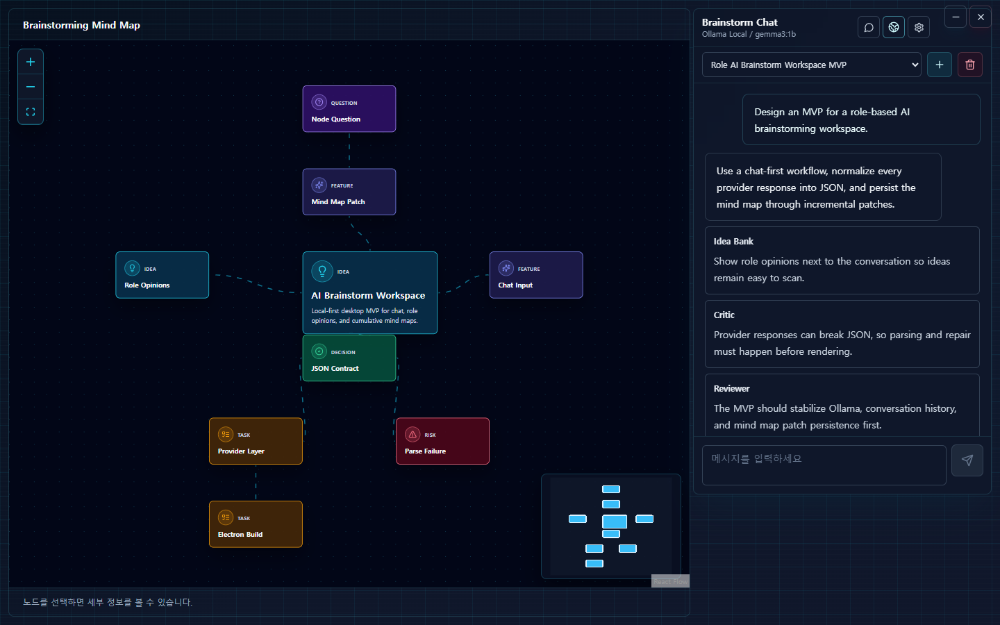
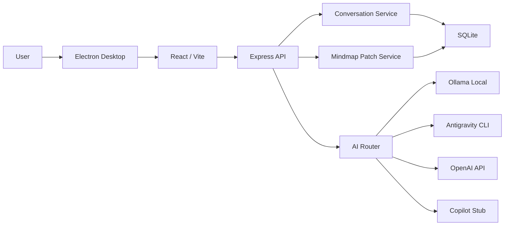

# Role AI Brainstorm Workspace

[](https://github.com/yungi0816/role-ai-brainstorm-workspace/actions/workflows/ci.yml)

[English README](README_ENG.md)

채팅으로 아이디어를 던지면 여러 역할의 AI가 같이 검토하고, 결과를 마인드맵에 계속 쌓아가는 데스크톱 앱입니다.

처음에는 "AI가 답은 해주는데, 대화가 길어질수록 구조가 안 남는다"는 불편에서 시작했습니다. 그래서 응답을 바로 화면에 뿌리지 않고, 공통 JSON으로 한 번 정리한 뒤 채팅과 마인드맵에 같이 반영하는 방식으로 만들었습니다.

아직 완성형 제품이라기보다는 로컬에서 브레인스토밍 흐름을 실험해보는 MVP에 가깝습니다.

## 실행 화면



## 왜 만들었나

- AI 답변을 채팅창에만 남기면 다시 이어서 생각하기가 어렵다.
- 여러 관점의 의견을 한 번에 보고 싶었다.
- 마인드맵은 매번 새로 그리는 것보다, 대화가 오갈 때마다 조금씩 쌓이는 편이 자연스럽다.
- Provider가 바뀌어도 프론트엔드는 같은 응답 구조만 다루게 만들고 싶었다.
- Ollama 같은 로컬 모델을 데스크톱 앱 안에서 무리하게 내장하지 않고, 사용자의 PC 환경을 진단해서 연결하는 흐름을 잡고 싶었다.

## 지금 되는 것

- React 채팅 UI에서 주제를 입력하고 AI 응답을 받을 수 있습니다.
- 아이디어 뱅크, 비판가, 검토자, 구현 설계자, 정리자 역할의 의견을 함께 저장합니다.
- AI 응답은 `chatResponse`, `agentOpinions`, `mindmapPatch`, `suggestedQuestions` 구조로 정규화합니다.
- 마인드맵은 전체 재생성이 아니라 patch 방식으로 노드와 엣지를 누적합니다.
- 마인드맵 노드를 클릭해서 해당 노드 기준으로 추가 질문할 수 있습니다.
- AI가 만든 마인드맵 노드의 제목, 타입, 부모, 설명을 직접 편집할 수 있습니다.
- 이전 대화 목록으로 돌아가서 이어서 작업할 수 있습니다.
- 대화, 역할 의견, 마인드맵 상태를 Markdown 또는 HTML 리포트로 내보낼 수 있습니다.
- Ollama 설치, 서버 실행, `localhost:11434` 연결, 모델 목록을 확인합니다.
- Provider 진단, 실행 테스트, 채팅 호출 로그를 설정 패널에서 확인할 수 있습니다.
- Electron 기반 Windows 데스크톱 앱과 installer 빌드를 지원합니다.
- GitHub Actions에서 backend smoke, frontend build, desktop smoke를 돌립니다.

## 아직 부족한 점

- 실제 사용 흐름을 보여주는 짧은 GIF는 아직 없습니다.
- OpenAI와 Antigravity CLI Provider는 동작 경로를 잡아두었지만, 계정/CLI 환경마다 더 많은 검증이 필요합니다.
- Copilot Provider는 나중에 OAuth나 SDK를 붙일 수 있도록 stub만 둔 상태입니다.
- installer 서명, 자동 업데이트, 배포 채널은 아직 없습니다.
- 마인드맵 레이아웃은 계속 다듬는 중입니다. 중앙 주제 고정, root 기준 분기, 중복 노드 병합은 들어가 있습니다.

## 구조



상세 구조는 [docs/architecture/README.md](docs/architecture/README.md)에 따로 정리했습니다.

## 신경 쓴 부분

**Provider 추상화**

Ollama, Antigravity CLI, OpenAI, Copilot은 실행 방식이 다릅니다. 프론트엔드가 그 차이를 몰라도 되도록 backend에서 Provider 응답을 하나의 계약으로 맞췄습니다.

**JSON 정규화**

AI는 JSON만 달라고 해도 설명 문장이나 markdown fence를 섞어서 줄 때가 있습니다. 그래서 원본 응답을 바로 렌더링하지 않고 JSON 파싱, repair, fallback parser, schema normalization을 거칩니다.

**마인드맵 patch 저장**

매 응답마다 전체 마인드맵을 다시 만들면 이전 대화의 맥락이 쉽게 깨집니다. 현재는 `addNodes`, `updateNodes`, `removeNodes`, `addEdges` 같은 patch를 저장하고, DB 상태에 누적합니다.

**로컬 실행 기준**

API key나 provider token을 프론트로 보내지 않습니다. backend는 기본적으로 `127.0.0.1`에 bind되고, credential 관련 route도 localhost 기준으로 제한했습니다.

## 구현하면서 막혔던 것

| 문제 | 처리 |
| --- | --- |
| AI가 JSON 밖에 설명을 붙임 | repair prompt와 fallback parser를 추가 |
| 마인드맵이 한 줄로만 뻗음 | root 노드 기준 reparent, 중복 label 병합, edge 검증 추가 |
| Ollama 상태를 사용자가 알기 어려움 | 설치, 프로세스, API 연결, 모델 목록을 분리해서 진단 |
| Provider 미설정 오류가 늦게 드러남 | Provider metadata에 `needs_auth`, `ready`, `planned` 상태를 노출 |
| Electron smoke가 CI에서 실패 | Linux CI에서만 `--no-sandbox` 옵션으로 실행 |

## 기술 스택

| 영역 | 사용 |
| --- | --- |
| Desktop | Electron, electron-builder |
| Frontend | React, Vite, Tailwind CSS, React Flow, Axios |
| Backend | Node.js, Express, dotenv, child_process |
| Database | SQLite, Node `node:sqlite` |
| AI Provider | Ollama Local, Antigravity CLI, OpenAI, Copilot Stub |
| 검증 | GitHub Actions, backend smoke, frontend build, desktop smoke |

## 실행

의존성 설치:

```bash
cd backend && npm install
cd ../frontend && npm install
cd ../desktop && npm install
```

데스크톱 실행:

```bash
cd desktop
npm start
```

웹 개발 모드로 따로 띄울 수도 있습니다.

```bash
cd backend
npm run dev
```

```bash
cd frontend
npm run dev
```

## 빌드

Windows installer:

```bash
cd desktop
npm run dist
```

생성 위치:

```text
desktop/artifacts/Role AI Brainstorm Workspace Setup 0.1.0.exe
```

## 환경 변수

| 변수 | 설명 |
| --- | --- |
| `HOST` | Backend bind host. 기본값은 `127.0.0.1` |
| `PORT` | Backend API port. 기본값은 `4000` |
| `DB_FILE` | SQLite DB 경로. Desktop runtime은 Electron `userData` 사용 |
| `CORS_ORIGIN` | standalone backend mode에서 허용할 origin |
| `OLLAMA_HOST` | Ollama endpoint. 기본값은 `http://localhost:11434` |
| `OPENAI_API_KEY` | OpenAI Provider 실행에 사용 |
| `ALLOW_REMOTE_PROVIDER_AUTH` | Provider credential route 원격 허용 여부. 기본값은 `false` 권장 |
| `ANTIGRAVITY_CLI_COMMAND` | Antigravity CLI 실행 명령. 기본값은 `agy` |
| `VITE_API_BASE_URL` | frontend dev mode API base URL |

## 검증

```bash
cd backend
npm run smoke
```

```bash
cd frontend
npm run build
```

```bash
cd desktop
npm run smoke
```

GitHub Actions는 `main` push와 pull request에서 같은 검증을 실행합니다.

## 문서

- [README_ENG.md](README_ENG.md)
- [docs/README.md](docs/README.md)
- [docs/architecture/README.md](docs/architecture/README.md)
- [docs/api/README.md](docs/api/README.md)
- [docs/database/README.md](docs/database/README.md)
- [docs/deployment/README.md](docs/deployment/README.md)
- [docs/workflow/README.md](docs/workflow/README.md)
- [docs/portfolio/README.md](docs/portfolio/README.md)
- [docs/roadmap/README.md](docs/roadmap/README.md)
- [SECURITY.md](SECURITY.md)

## License

[MIT License](LICENSE)
