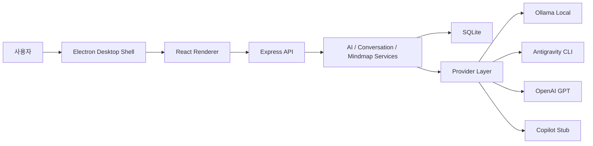

# Role AI Brainstorm Workspace

[](https://github.com/yungi0816/role-ai-brainstorm-workspace/actions/workflows/ci.yml)

[English README](README_ENG.md)

역할 기반 AI 브레인스토밍 워크스페이스는 채팅 UI, 다중 역할 AI 의견, 누적 마인드맵을 결합한 데스크톱 중심 아이디어 정리 도구입니다. 사용자가 기획 주제나 과제를 입력하면 아이디어 뱅크, 비판가, 검토자, 구현 설계자, 정리자 관점의 응답을 공통 JSON 구조로 정규화하고, 그 결과를 채팅과 마인드맵에 동시에 반영합니다.

이 프로젝트는 단순히 AI 응답을 화면에 출력하는 데모가 아니라, Provider 추상화, JSON 정규화, 마인드맵 patch 저장, 로컬 데스크톱 패키징, 공개 레포 기준 보안/CI까지 포함한 풀스택 포트폴리오 프로젝트입니다.

## 프로젝트 요약

| 항목 | 내용 |
| --- | --- |
| 문제 정의 | 브레인스토밍 결과가 채팅에만 남으면 구조화와 후속 질문이 어렵다. |
| 해결 방향 | 역할별 AI 의견을 공통 응답 구조로 정규화하고, 마인드맵을 patch 방식으로 누적 업데이트한다. |
| 실행 형태 | React/Vite 프론트엔드와 Express/SQLite 백엔드를 Electron 데스크톱 앱으로 패키징한다. |
| 주요 Provider | Ollama Local, Antigravity CLI, OpenAI API Key 기반 Provider, Copilot Stub |
| 현재 상태 | 로컬 데스크톱 MVP, Windows installer 빌드, GitHub Actions smoke 검증 구성 |

## 핵심 기능

| 기능 | 설명 | 상태 |
| --- | --- | --- |
| 채팅 기반 워크스페이스 | 카카오톡처럼 주제를 입력하고 AI 응답을 대화 흐름으로 확인 | 구현 |
| 역할 기반 브레인스토밍 | 아이디어 뱅크, 비판가, 검토자, 구현 설계자, 정리자 의견 생성 | 구현 |
| 공통 JSON 응답 계약 | Provider별 응답을 `chatResponse`, `agentOpinions`, `mindmapPatch`로 정규화 | 구현 |
| 누적 마인드맵 | 전체 재생성이 아니라 add/update/remove patch로 노드와 엣지 저장 | 구현 |
| 노드 후속 질문 | 마인드맵 노드를 선택하고 해당 노드 기준으로 추가 질문 | 구현 |
| Ollama 런타임 진단 | 설치 여부, 서버 실행, `localhost:11434` 연결, 모델 목록 확인 | 구현 |
| Provider 설정/진단 | Provider 준비 상태와 인증 필요 상태를 UI에서 확인 | 구현 |
| 데스크톱 패키징 | Electron shell과 Windows NSIS installer 구성 | 구현 |
| CI 검증 | backend smoke, frontend build, desktop smoke GitHub Actions 구성 | 구현 |

## 기술 스택

| 영역 | 기술 |
| --- | --- |
| Desktop | Electron, electron-builder |
| Frontend | React, Vite, Tailwind CSS, React Flow, Axios |
| Backend | Node.js, Express, dotenv, child_process |
| Database | SQLite, Node `node:sqlite` |
| AI Provider | Ollama Local, Antigravity CLI, OpenAI, Copilot Stub |
| Quality | GitHub Actions, backend smoke test, desktop smoke test |

## 아키텍처



상세 구조와 데이터 흐름은 [docs/architecture/README.md](docs/architecture/README.md)에 정리했습니다.

## My Key Contributions

- Provider가 달라도 프론트엔드는 동일한 응답 계약만 사용하도록 `BaseProvider`와 `aiRouterService`를 설계했습니다.
- AI 응답을 그대로 렌더링하지 않고 JSON 파싱, repair prompt, fallback parser, schema-level normalization을 거치도록 구성했습니다.
- 마인드맵을 전체 재생성하지 않고 patch 방식으로 누적 저장하도록 `mindmapPatchService`를 구현했습니다.
- root 노드 보호, 중복 라벨 병합, self/cross edge 차단, 순환 parent 방지 등 AI 출력의 불안정성을 DB 저장 단계에서 방어했습니다.
- Ollama를 앱에 내장하지 않고 설치/서버/연결/모델 상태를 진단하는 로컬 런타임 관리 방식으로 설계했습니다.
- Electron 데스크톱 shell에서 backend와 renderer를 함께 실행하고, 사용자 데이터 경로에 SQLite를 저장하도록 구성했습니다.
- 공개 레포 전환을 위해 MIT License, SECURITY 문서, secret scanning, CI smoke test를 정리했습니다.

## Troubleshooting

| 문제 | 원인 | 해결 |
| --- | --- | --- |
| AI 응답 JSON 파싱 실패 | Provider가 설명 문장이나 markdown fence를 함께 반환 | JSON repair prompt와 fallback parser로 공통 구조 복구 |
| 마인드맵이 한 줄로 뻗거나 중복 노드 생성 | AI가 parentId를 누락하거나 같은 의미의 노드를 반복 생성 | root 기준 reparent, 중복 label 병합, tree edge 검증 추가 |
| Ollama 연결 실패 | 사용자의 PC에 Ollama가 없거나 서버가 실행되지 않음 | 설치 여부, 프로세스, `/api/version`, 모델 목록을 단계별로 진단 |
| OpenAI/Copilot 미설정 오류 | 인증 정보가 없는 Provider가 선택됨 | Provider metadata에 `needs_auth`, `planned`, diagnostics 상태를 노출 |
| GitHub Actions Electron smoke 실패 | Linux runner의 Chromium sandbox 권한 문제 | CI 환경에서만 Electron을 `--no-sandbox`로 실행 |

## 실행 방법

패키지별 의존성을 설치합니다.

```bash
cd backend && npm install
cd ../frontend && npm install
cd ../desktop && npm install
```

데스크톱 앱을 실행합니다.

```bash
cd desktop
npm start
```

웹 개발 모드로 분리 실행할 수도 있습니다.

```bash
cd backend
npm run dev
```

```bash
cd frontend
npm run dev
```

## 데스크톱 빌드

Windows installer를 생성합니다.

```bash
cd desktop
npm run dist
```

생성 위치:

```text
desktop/artifacts/Role AI Brainstorm Workspace Setup 0.1.0.exe
```

## 환경 변수

| 변수 | 필수 여부 | 설명 |
| --- | --- | --- |
| `HOST` | 아니오 | Backend bind host. 기본값은 `127.0.0.1` |
| `PORT` | 아니오 | Backend API port. 기본값은 `4000` |
| `DB_FILE` | 아니오 | SQLite DB 경로. Desktop runtime은 Electron `userData` 사용 |
| `CORS_ORIGIN` | 아니오 | standalone backend mode에서 허용할 origin |
| `OLLAMA_HOST` | 아니오 | Ollama endpoint. 기본값은 `http://localhost:11434` |
| `OPENAI_API_KEY` | OpenAI 사용 시 | OpenAI Provider 실행에 사용 |
| `ALLOW_REMOTE_PROVIDER_AUTH` | 아니오 | Provider credential route 원격 허용 여부. 기본값은 `false` 권장 |
| `ANTIGRAVITY_CLI_COMMAND` | 아니오 | Antigravity CLI 실행 명령. 기본값은 `agy` |
| `VITE_API_BASE_URL` | frontend dev only | Vite 개발 모드 API base URL |

## 검증

GitHub Actions는 `main` push와 pull request에서 아래 검증을 수행합니다.

| 검증 | 명령 |
| --- | --- |
| Backend API smoke test | `cd backend && npm run smoke` |
| Frontend production build | `cd frontend && npm run build` |
| Desktop smoke test | `cd desktop && npm run smoke` |

```bash
cd backend
npm run smoke
```

```bash
cd frontend
npm run build
```

```bash
cd desktop
npm run smoke
```

## 문서

| 영역 | 문서 |
| --- | --- |
| English README | [README_ENG.md](README_ENG.md) |
| Documentation Index | [docs/README.md](docs/README.md) |
| Architecture | [docs/architecture/README.md](docs/architecture/README.md) |
| API | [docs/api/README.md](docs/api/README.md) |
| Database | [docs/database/README.md](docs/database/README.md) |
| Desktop Packaging | [docs/deployment/README.md](docs/deployment/README.md) |
| Development Workflow | [docs/workflow/README.md](docs/workflow/README.md) |
| Security | [SECURITY.md](SECURITY.md) |
| Roadmap | [docs/roadmap/README.md](docs/roadmap/README.md) |

## 공개 레포 안전 기준

- Backend는 기본적으로 `127.0.0.1`에 bind됩니다.
- `.env`, local SQLite DB, log, installer artifact는 git에 포함하지 않습니다.
- Provider credential route는 기본적으로 localhost 요청만 허용합니다.
- 개인 API key를 설정한 상태로 public internet에 backend를 노출하지 않는 것을 전제로 합니다.

## 라이선스

이 프로젝트는 [MIT License](LICENSE)를 따릅니다.
