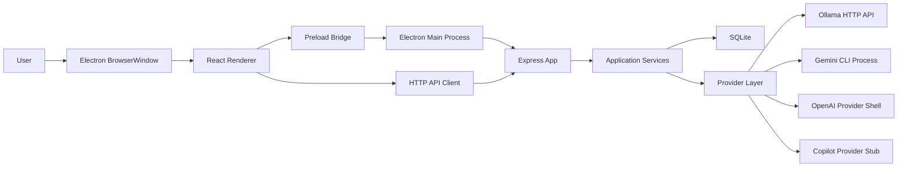
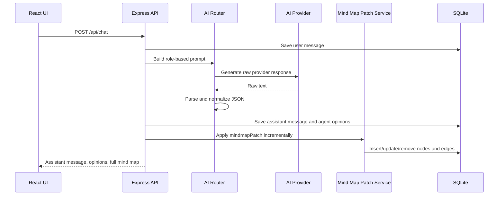

# Architecture

Role AI Brainstorm Workspace is currently organized as a local desktop application with a bundled backend and a React renderer.

## Runtime Topology

## Subsystems

| Subsystem | Path | Responsibilities |
| --- | --- | --- |
| Electron shell | `desktop/` | Starts the backend, owns the desktop window, exposes safe preload APIs, builds Windows installer artifacts. |
| React renderer | `frontend/` | Chat-first UI, AI settings panel, Ollama setup panel, React Flow mind map visualization. |
| Express API | `backend/src/routes/` | Exposes chat, provider, and mind map HTTP routes. |
| Application services | `backend/src/services/` | AI routing, prompt construction, response normalization, persistence, mind map patching, Ollama runtime checks. |
| Provider layer | `backend/src/providers/` | Provides common provider contracts for Ollama, Gemini CLI, OpenAI, and Copilot. |
| Database layer | `backend/src/db/` | Initializes SQLite and applies the schema. |

## Primary AI Flow

## AI Response Contract

All provider output is normalized into:

- `chatResponse`
- `agentOpinions`
- `mindmapPatch`
- `suggestedQuestions`

Providers are not allowed to leak provider-specific response structures to the frontend. JSON parsing failures fall back to a normalized response with empty mind map patches.

## Desktop Window Model

The application opens as a compact chat window. The globe control expands the Electron window from the chat shell so the mind map can occupy the newly available left and lower area. Minimize and close controls are shared at the app level, while provider settings and mind map toggles remain chat-level controls.

## Current Constraints

- The backend is local-only by default.
- The desktop package currently disables ASAR to keep backend resources directly available.
- `node:sqlite` is experimental in the Node version used during development.
- Ollama itself is not bundled; the app detects installation and guides the user to install or start it.
