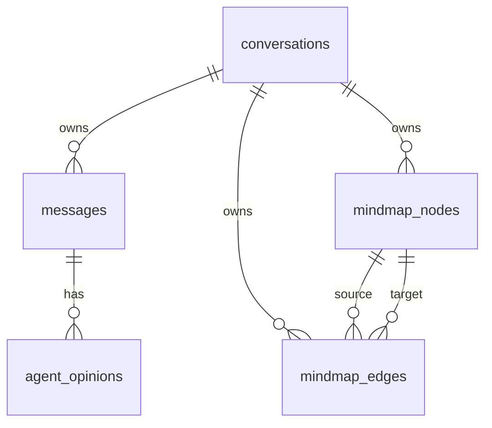

# Database

The backend persists conversations, messages, role opinions, and mind map state in SQLite.

## Location

Standalone backend mode defaults to:

```text
backend/data/app.db
```

Desktop mode stores the database under Electron `userData` unless `DB_FILE` is explicitly configured.

## Tables

| Table | Responsibility |
| --- | --- |
| `conversations` | Conversation metadata, selected provider, selected model, timestamps. |
| `messages` | User and assistant message history. |
| `agent_opinions` | Role-specific AI opinions linked to assistant messages. |
| `mindmap_nodes` | Persisted mind map nodes by conversation. |
| `mindmap_edges` | Persisted mind map edges by conversation. |

## Relationships



## Mind Map Persistence Model

The app applies AI-generated `mindmapPatch` objects incrementally:

- `addNodes`
- `updateNodes`
- `removeNodes`
- `addEdges`
- `updateEdges`
- `removeEdges`

Invalid patch entries are skipped rather than failing the entire chat turn. Edge additions are ignored when source or target nodes do not exist in the same conversation.

## Node Types

Mind map nodes are constrained to:

- `idea`
- `risk`
- `feature`
- `task`
- `decision`
- `question`

## Schema Source

The authoritative schema is [backend/src/db/schema.sql](../../backend/src/db/schema.sql).
